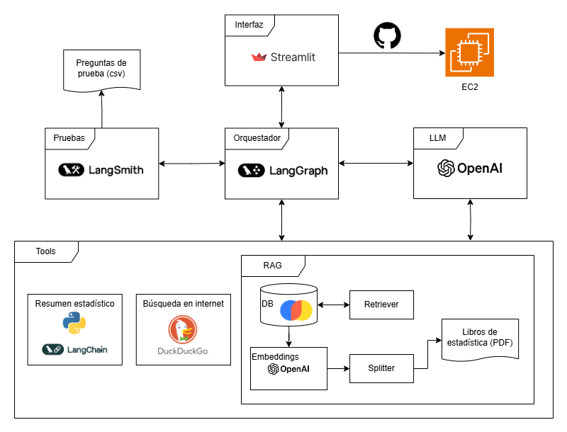

# 📊 Agente de Enseñanza de Estadística Básica

Este proyecto es un agente educativo diseñado para ayudar a estudiantes universitarios en sus primeros semestres a comprender los conceptos fundamentales de **Estadística Básica y Probabilidad**. A través de una interfaz amigable y dos modos de interacción (libre y guiado), el agente se adapta al ritmo y nivel de cada estudiante para brindar apoyo personalizado.

---

## 🚀 ¿Qué hace el agente?

- **Modo libre**: Puedes conversar con el agente y hacerle cualquier pregunta sobre estadística.
- **Modo guiado**: El agente te evalúa con un test por niveles (básico, intermedio y avanzado), identifica tus fortalezas/debilidades y genera un plan de estudios personalizado a partir de estas, y te guía con explicaciones tema por tema.
- Puedes alternar entre ambos modos en cualquier momento, según tus necesidades.

## 📄 [Ver documentación completa del agente](Documentacion_agente.pdf)

---

## 🛠️ Especificaciones técnicas

- **Orquestación**: LangGraph
- **LLM**: GPT-4.1 de OpenAI
- **Herramientas del agente**:
  - Tool personalizada: generar resúmenes estadísticos. Función personalizada en Python convertida a tool con LangChain.
  - DuckDuckGo: búsqueda de información en tiempo real.
  - RAG: usando PDFs de libros universitarios de estadística. Base de datos de ChromaDB y embeddings de OpenAI.  
- **Evaluación**: LangSmith + QAEvalChain
- **Frontend**: Streamlit
- **Despliegue**: AWS EC2 + GitHub Actions

### 🧱 Arquitectura del agente



---

## 🧪 Clonar y ejecutar el proyecto

1. Clona este repositorio o hazle un git fetch.

2. Instala los paquetes necesarios:
   ```bash
   pip install -r requirements.txt
   ```

3. Ejecuta el script para crear la base de datos de ChromaDB:
   ```bash
   python src/create_VDB.py
   ```

4. Inicia la aplicación:
   ```bash
   streamlit run src/app.py
   ```

---

## 🎥 Video demo

👉 Mira el demo completo de uso del agente aquí:  
[🔗 YouTube - Demo del Agente Educativo](https://youtu.be/TDtKL5xZIps?si=WQrrc7gHHjZhcWHk)

---

## 📌 Créditos

- Jose Manuel Jiménez Gómez
- Diego Alexander Giraldo Tirado  
- Daniela Ximena Niño Barbosa  
